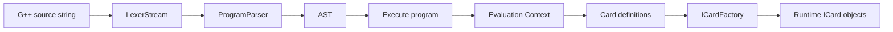
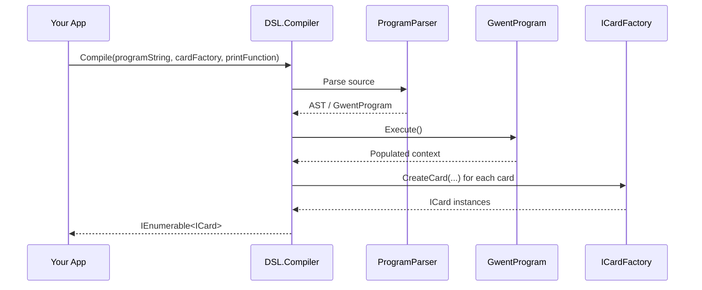

# GwentPPCompiler

GwentPPCompiler is a C# domain-specific language (DSL) compiler for building **Gwent-like card game content**.

It parses a G++ program, evaluates it, and turns the resulting card definitions into runtime card objects through a user-provided `ICardFactory`.

## What this project does

At a high level, the compiler:

1. Reads a G++ source string.
2. Tokenizes and parses it into an AST.
3. Executes the parsed program in an evaluation context.
4. Collects the cards created by the program.
5. Converts those cards into your game’s own card objects via `ICardFactory`.

This means the repository is not the game itself, but the language and compiler layer for describing game cards and their effects.

## What this language handles

The DSL is a **JSON-like language with delegates** focused on card/effect authoring for GWENT-style mechanics.

- **JSON-like structure**: declarations are block-based key/value objects such as `card { ... }`, `effect { ... }`, `Params { ... }`, `Selector { ... }`.
- **Delegate-style behavior**: effects contain executable delegate bodies such as:
  - `Action: (targets, context) => { ... }`
  - `Predicate: (unit) => unit.Type == "Silver"`
- **Composable activation pipeline**: `OnActivation` supports chaining `Effect`, `Selector`, and `PostAction`.
- **Game operations**: draw cards, remove cards, modify power, aggregate across selections, and print runtime diagnostics.

## How to use it

The main entry point is:

```csharp
DSL.Compiler.Compile(string programString, ICardFactory cardFactory, Action<string> printFunction)
```

### Required inputs

- `programString`: the G++ source code to compile.
- `cardFactory`: your implementation of `ICardFactory`, used to build your game’s card objects.
- `printFunction`: a callback used by the DSL `print(...)` statement.

### Expected flow

```csharp
var cards = DSL.Compiler.Compile(
    programString,
    myCardFactory,
    Console.WriteLine
);
```

### Implementing `ICardFactory`

The compiler delegates card creation to your factory:

```csharp
public interface ICardFactory
{
    ICard CreateCard(string name, string faction, string type,
        IList<string> range, double power, IEffect effect);
}
```

So your application decides how DSL-defined cards map to your own game model.

### Typical integration steps

1. Reference the project from your game/tooling application.
2. Implement `ICardFactory` and the related runtime interfaces (`ICard`, `IEffect`).
3. Pass a G++ script into `Compiler.Compile(...)`.
4. Use the returned `IEnumerable<ICard>` in your game.

## Language overview

The DSL appears to support:

- card and effect declarations
- variables and assignments
- arithmetic and boolean expressions
- `if`, `while`, and `for` statements
- function-like actions and delegates
- lists, selectors, and type restrictions
- `print(...)`
- ternary expressions

## Architecture

The project is organized as a pipeline:



### Main components

#### 1. Lexer
Converts raw text into tokens.

- `Lexer/Token.cs`
- `Lexer/TokenType.cs`

#### 2. Parser
Builds the program structure from tokens.

- `Parser/ProgramParser.cs`
- `Parser/ExpressionParser.cs`
- `Parser/InstructionParsercs.cs`

#### 3. AST / Evaluator
Represents and executes the program.

- `Evaluator/AST/...`
- `Evaluator/LenguajeTypes/...`

#### 4. Compiler facade
A single public API that ties everything together.

- `Compiler.cs`

## Execution flow inside `Compile(...)`



## Notes

- The repository description says: `DSL made it for GWENT-like games.`
- The compiler relies on the host application to provide the concrete card implementation.
- `printFunction` is injected, so output handling stays outside the DSL runtime.

## Example usage

```csharp
using DSL;
using DSL.Interfaces;
using System;
using System.Collections.Generic;

public class MyCardFactory : ICardFactory
{
    public ICard CreateCard(string name, string faction, string type, IList<string> range, double power, IEffect effect)
    {
        // Map DSL data to your game card here.
        throw new NotImplementedException();
    }
}

var program = @"
card { }
";

var cards = Compiler.Compile(program, new MyCardFactory(), Console.WriteLine);
```

## Important example DSL script

This is a complete example showing the JSON-like declaration style plus delegate-based `Action`/`Predicate` behavior.

```txt
effect
{
 Name : "KillPowerfulCard",
 Action :(targets,context) =>
 {
	maxPower = 0;
	powerfulCard = 0;
	for target in targets
	{
		if(target.Power>maxPower)
		{
			powerfulCard=target;
			maxPower = target.Power;
		}
	}
	if(powerfulCard!=0)
	{
		context.Board.Remove(powerfulCard);
	}
 }
}
effect
{
	Name : "BalanciatePoints",
	Action: (targets,context) =>
	{
		sum = 0;
		for target in targets
			sum +=target.Power;
		averagePower = sum/targets.Count;
		for target in targets
			target.Power = averagePower;
	}
}
effect 
{
 Name : "Kill",
 Action :(targets,context) => 
 {
	for target in targets
	{
		context.Board.Remove(target);
	}
 }
}
effect
{
	Name : "Void",
	Action:(targets,context) =>{}
}
effect
{
	Name : "MultiplyByN",
	Action : (targets,context) => 
	{
		for target in targets
		{
			target.Power = target.Power*targets.Count;
		}
	}
}
effect
{
	Name :"ModifyPoints",
	Params :
	{
		Quotient: Number
	},
	Action :(targets,context) =>
	{
		for target in targets
			target.Power=target.Power*Quotient;
	}
}
effect 
{
	Name: "Draw",
	Params:{
		Amount : Number
	},
	Action :(targets,context) =>{
		i = 0;
		while(i<Amount)
		{
			kard = context.Deck.Pop();
			context.Hand.Push(kard);
			i++;
		}
	}
}

effect
{
	Name: "PrintInfo",
	Action: (targets,context) =>
	{
		print("######################");
		print("PRINTING INFO ...");
		for target in targets
			print("Card"@@target.Name@@"has"@@target.Power@@"points");
		print("######################");
		
	}
}
card 
{
	Type:"Leader",
	Name : "Dipper",
	Faction : "Goods",
	Power : 0,
	Range:[],
	OnActivation : 
	[
		{
			Effect : 
			{
				Name:"Draw",
				Amount : 1
			},
			Selector:
			{
				Source : "otherField",
				Single: false,
				Predicate : (unit) => true
			},
			PostAction:
			{
				Effect:
				{ 
					Name :"PrintInfo"
				}
			}
		}
	]
}

card 
{
	Type:"Gold",
	Name : "Mabel",
	Faction : "Goods",
	Power : 7,
	Range:["Melee","Ranged","Siesge"],
	OnActivation : 
	[
		{
			Effect : 
			{
				Name:"KillPowerfulCard"
			},
			Selector:
			{
				Source : "board",
				Predicate : (unit) => unit.Type=="Silver"
			},
			PostAction:
			{
				Effect: {
					Name : "PrintInfo"
				}
			}
		}
	]
}
card 
{
	Type:"Gold",
	Name : "Stan",
	Faction : "Goods",
	Power : 8,
	Range:["Melee","Siesge"],
	OnActivation : 
	[
		{
			Effect : 
			{
				Name:"Draw",
				Amount : 1
			},
			Selector:
			{
				Source : "board",
				Single: false,
				Predicate : (unit) => unit.Power<8
			},
			PostAction:
			{
				Effect: {
					Name : "PrintInfo"
				}
			}
		}
	]
}
card{
	Name : "Wendy",
	Type : "Silver",
	Faction : "Goods",
	Power : 4,
	Range : ["Melee"],
	OnActivation :
		[
			{
				Effect :
				{
				  Name : "MultiplyByN"
				},
				Selector:
				{
					Source : "board",
					Predicate : (unit) => unit.Name == "Wendy"
				},
				PostAction :
				{
					Effect :
					{
						Name : "PrintInfo"
					}
				}
			}
		]
}
card
{
	 Name : "BlendinBlandin",
	 Type : "Silver",
	 Range : ["Ranged","Siesge"],
	 Power : 4,
	 Faction : "Goods",
	 OnActivation : 
	 [
		{
			Effect :
			{
				Name : "BalanciatePoints"
			},
			Selector:
			{
				Source : "board",
				Single : false,
				Predicate : (unit) => unit.Type=="Silver"||unit.Type=="Gold"||unit.Type=="Decoy"
			},
			PostAction :
			{
				Effect:{
				Name : "PrintInfo"
				}
			}
		}
	 ]
}
card
{
	 Name : "Pacifica",
	 Type : "Gold",
	 Range : ["Ranged"],
	 Power : 4,
	 Faction : "Goods",
	 OnActivation : 
	 [
		{
			Effect :
			{
				Name : "ModifyPoints",
				Quotient : 5
			},
			Selector:
			{
				Source : "field",
				Single : false,
				Predicate : (unit) => unit.Type=="Silver" && unit.Power<5
			},
			PostAction :
			{
				Effect :{
				Name : "PrintInfo"
				}
			}
		}
	 ]
}

card{
	Name : "Robby",
	Type : "Silver",
	Range : ["Melee","Ranged"],
	Power : 4,
	Faction : "Goods",
	OnActivation : 
	[
		{
			Effect :
			{
				Name : "ModifyPoints",
				Quotient : 2*10^-1
			},
			Selector:
			{
				Source : "board",
				Single : false,
				Predicate : (unit) => unit.Type=="Silver" && unit.Power>7
			},
			PostAction :
			{
				Effect:
				{
				Name : "PrintInfo"
				}
			}
		}
	]
}
card{
	Name : "Soos",
	Type : "Silver",
	Range : ["Melee","Ranged"],
	Power : 4,
	Faction : "Goods",
	OnActivation : 
	[
		{
			Effect :
			{
				Name : "Kill"
			},
			Selector:
			{
				Source : "board",
				Single : false,
				Predicate : (unit) =>unit.Type=="Silver"&&unit.Power<5
			},
			PostAction :
			{
				Effect : {
				Name : "PrintInfo"
				}
			}
		}
	]
}
card{
	Name : "Gideon",
	Type : "Gold",
	Range : ["Melee","Ranged","Siesge"],
	Power : 4,
	Faction : "Goods",
	OnActivation : 
	[
		{
			Effect :
			{
				Name : "Kill"
			},
			Selector:
			{
				Source : "otherField",
				Single : true,
				Predicate : (unit) => unit.Type=="Silver" && unit.Power<=4
			},
			PostAction  :
			{
				Effect: {
					Name : "PrintInfo"
				}
			}
		}
	]
}
card
{
	Name : "Tormenta",
	Type : "Weather",
	Range : ["Siesge"],
	Power : 0,
	Faction : "Neutral",
	OnActivation : []
}
card
{
	Name : "Diluvio",
	Type : "Weather",
	Range : ["Melee"],
	Power : 0,
	Faction : "Neutral",
	OnActivation :[]
}
card
{
	Name : "Niebla",
	Type : "Weather",
	Range : ["Ranged"],
	Power : 0,
	Faction : "Neutral",
	OnActivation :[]
}
card 
{
 Name : "LinternaDeCrecimiento",
 Type : "Boost",
 Range : ["Siesge"],
 Power : 0,
 Faction : "Neutral",
 OnActivation :[]
}
card
{
 Name : "CirculoDeUnidad",
 Type : "Boost",
 Range : ["Melee"],
 Power : 0,
 Faction : "Neutral",
 OnActivation :[]
}
card 
{
 Name : "PittCola",
 Type : "Boost",
 Range : ["Ranged"],
 Power : 0,
 Faction : "Neutral",
 OnActivation : []
}

card 
{
 Name : "SolResplandeciente",
 Type : "Clearing",
 Range : ["Melee","Ranged","Siesge"],
 Power : 0,
 Faction : "Neutral",
 OnActivation : []
}
card 
{
	Name : "Pato",
	Type : "Decoy",
	Range : ["Melee","Ranged","Siesge"],
	Power : 0,
	Faction : "Neutral",
	OnActivation : []
}
```
